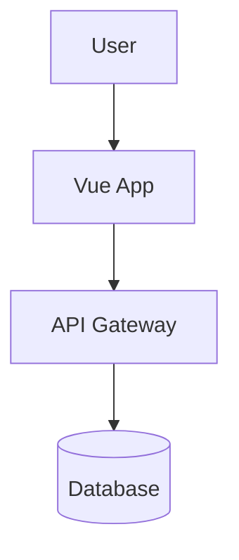

# Architecture Visualization Skillset

A transportable AI skillset for generating architecture diagrams from codebases. This self-contained folder can be copied to any repository to enable architecture visualization capabilities.

## 🎯 Purpose

This skillset teaches AI agents to:

- **Discover** application architecture automatically
- **Generate** Mermaid diagrams at multiple abstraction levels
- **Adapt** to different frameworks (Vue, React, Angular, etc.)
- **Customize** via optional configuration

## 📊 Available Diagram Types

### 1. System Diagram

Shows the application within its ecosystem: external services, APIs, authentication, deployment boundaries.

**Example prompt:** `"Generate a system architecture diagram for this app"`

### 2. Module Diagram

Displays major subsystems and their dependencies: admin modules, component libraries, store modules, API layers.

**Example prompt:** `"Show me the module-level architecture"`

### 3. Component Diagram

Visualizes component hierarchies, parent-child relationships, props, and event flows.

**Example prompt:** `"Create a component hierarchy diagram for ActivityView"`

### 4. Data Flow Diagram

Traces data through the application using sequence diagrams: user actions → components → state → APIs.

**Example prompt:** `"Show the data flow for saving workout data"`

### 5. State Management Diagram

Maps state management architecture: store modules, actions, mutations, getters, and their relationships.

**Example prompt:** `"Diagram the Vuex store architecture"`

### 6. Routing Diagram

Illustrates route structure: nested routes, guards, lazy loading, and navigation flows.

**Example prompt:** `"Show me the routing structure"`

## 🚀 Quick Start

### Basic Usage

Simply reference the skillset in your prompt:

```
Using the architecture-viz skillset, generate a system diagram.
```

Or more directly:

```
Generate a full architecture diagram for this Vue app.
```

The AI will:

1. Detect your framework automatically
2. Discover entry points and structure
3. Generate an appropriate Mermaid diagram
4. Provide the diagram with context

### Interactive Commands

After generating a diagram, you can:

- **Drill down:** `"Expand the component structure for the admin module"`
- **Focus:** `"Show only the authentication flow"`
- **Refine:** `"Add more detail about the API layer"`
- **Switch levels:** `"Show this as a component diagram instead"`

## 🎛️ Customization (Optional)

For projects with non-standard structure, create `.architecture-config.json` in your project root:

```json
{
  "framework": "vue",
  "componentOrganization": "by-type",
  "componentPaths": {
    "core": "src/components/core/**/*.vue",
    "features": "src/components/pac/**/*.vue",
    "ui": "src/components/ui/**/*.vue"
  },
  "moduleBoundaries": [
    {
      "name": "Admin Subsystem",
      "path": "src/admin/",
      "description": "Role-based admin interface"
    }
  ],
  "namingPatterns": {
    "singleton": "The*",
    "view": "*View"
  }
}
```

See [config-schema.json](./config-schema.json) for full schema.

## 📦 Portability

This skillset is **completely self-contained**. To use in another project:

1. Copy the entire `architecture-viz/` folder
2. Place it in `.github/copilot/` (or any location)
3. Reference it in your prompts
4. Optionally add `.architecture-config.json` to customize

No external dependencies or repository-wide changes required!

## 🏗️ Structure

```
architecture-viz/
├── README.md              # This file - usage guide
├── skill.md               # Core AI instructions
├── config-schema.json     # Configuration schema
├── patterns/              # Framework detection patterns
│   ├── vue.md            # Vue-specific patterns
│   ├── common.md         # Universal patterns
│   └── react.md          # React patterns (stub)
├── templates/             # Mermaid diagram templates
│   ├── system.md         # System-level diagrams
│   ├── module.md         # Module-level diagrams
│   ├── component.md      # Component hierarchies
│   ├── dataflow.md       # Data flow sequences
│   ├── state.md          # State management
│   └── routing.md        # Route structures
└── examples/              # Reference examples
    ├── harper-system.md   # Example system diagram
    └── harper-modules.md  # Example module diagram
```

## 📚 How It Works

1. **Framework Detection:** Analyzes `package.json` to identify framework and libraries
2. **Entry Point Discovery:** Locates `main.js`, `App.vue`, `index.ts`, etc.
3. **Structure Mapping:** Traverses directories to understand organization
4. **Pattern Recognition:** Applies framework-specific and universal patterns
5. **Diagram Generation:** Uses templates to create appropriate Mermaid syntax
6. **Adaptive Granularity:** Starts high-level, drills down on request

## 🎨 Output Format

All diagrams are generated as **Mermaid** syntax in markdown code blocks:

````markdown

````

Renders natively in:

- GitHub
- VS Code (with Mermaid extension)
- GitLab
- Most modern markdown viewers

## 🔧 Maintenance

When adding support for new frameworks:

1. Create pattern file in `patterns/` (e.g., `angular.md`)
2. Document framework-specific detection rules
3. Test with sample projects
4. Update this README

## 💡 Tips

- **Be specific:** "Show the authentication data flow" > "Show me a diagram"
- **Iterate:** Start with system view, then drill into specific areas
- **Combine:** "Show component hierarchy AND data flow for the calendar module"
- **Customize:** Use config file for complex or non-standard projects

## 📖 Examples

See the `examples/` directory for:

- Real-world diagram outputs
- Formatting standards
- Mermaid syntax patterns

## 🤝 Contributing

This skillset improves with use! Consider:

- Adding framework patterns for your stack
- Creating template variations
- Documenting edge cases
- Sharing successful customizations

---

**Version:** 1.0.0  
**Last Updated:** February 6, 2026  
**Maintainer:** Your team
