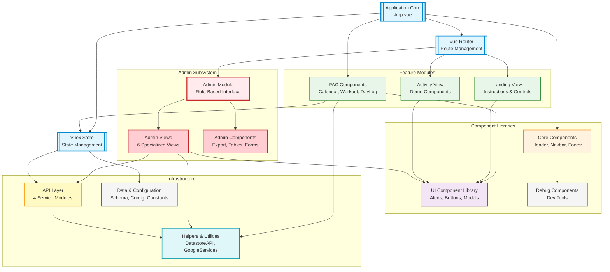

# Harper App - Module Architecture Example

This is an example module-level architecture diagram for the Harper physical activity course application, showing internal subsystems and their relationships.

## Diagram

## Detailed Module Breakdown

### Application Core

**App.vue**

- Root component with application shell
- Manages DatastoreAPI mixin for CRUD operations
- Watches route changes to trigger data loading
- Coordinates between router, store, and datastore
- Includes: TheHeader, TheNavbar, CalendarComponent, router-view, TheFooter

**Vue Router**

- Manages application navigation
- Dynamically loads routes based on configuration
- Implements route guards (`authUser`, `authAdmin`)
- Conditional route registration based on environment variables
- Lazy loads admin module for code splitting

**Vuex Store**

- Four modules:
  - **app**: Application state (data schema, logs, workouts)
  - **auth**: Authentication (token, user, role)
  - **datastore**: External persistence state (entry, entryId, entryLoaded)
  - **env**: Environment configuration getters (feature flags)
- Centralizes state management
- Provides mappers between external and internal state formats

### Feature Modules

**PAC Components** (Physical Activity Course)

- `CalendarComponent`: Weekly calendar interface
- `CalendarDay`: Individual day representation
- `DayLogPanel`: Daily log input form
- `DayLogInput`: Input controls for logs
- `WorkoutBuilder`: Workout creation interface
- `WorkoutDisplay`: Workout presentation

**Landing View**

- Entry point for users
- Displays instructions and user controls
- Conditionally shown based on config
- Links to main activity area

**Activity View**

- Demonstrates UI component usage
- Examples of CustomAlert and SaveButton
- Used for testing and development

### Admin Subsystem

**Isolated Module** (`src/admin/`)

- Self-contained admin interface
- Own route configuration (`admin.js`)
- Own component library
- Role-based access (requires ROLE.ADMIN)

**Admin Views:**

1. `ConfigView` - System configuration management
2. `ContentView` - Content entry management
3. `InstructionsView` - Instructional content editing
4. `MetricsView` - Analytics and metrics dashboard
5. `ParticipantsView` - Student data and progress
6. `SettingsView` - Application settings

**Admin Components:**

- `AdminNavbar`: Admin-specific navigation
- `AdminSortTable`: Sortable data tables
- `AdminExport`: Data export functionality
- `AdminActiveEntry`: Active data entry display
- `AdminCustomEntry`: Custom entry forms
- `AdminReset`: Reset functionality

### Component Libraries

**Core Components** (`src/components/core/`)

- `TheHeader`: Application header (singleton)
- `TheNavbar`: Main navigation bar (singleton)
- `TheFooter`: Application footer (singleton)
- `TheAccessibility`: Accessibility features
- `VersionCheck`: Version validation
- `DataCollectionModal`: Data collection consent

**UI Component Library** (`src/components/ui/`)
Reusable presentational components:

- `CustomAlert`: Styled alert boxes
- `SaveButton`: Button with save confirmation
- `LoadingBar`: Loading indicator
- `CertificateOfCompletion`: Achievement certificate
- Plus additional UI primitives

**Debug Components** (`src/components/debug/`)
Development and debugging tools (conditional):

- `TheDebugger`: Main debug panel
- `DebugAuth`: Auth state inspector
- `DebugDatastore`: Datastore state viewer
- `DebugEnv`: Environment variable display
- `TheBreakpoints`: Responsive breakpoint indicator

### Infrastructure Layer

**API Layer** (`src/apis/`)

- `base.js`: Axios configuration, auth headers, base URL
- `content.js`: Content API service (Google Sheets)
- `settings.js`: Settings API service
- `metrics.js`: Metrics API service
- `post.js`: Generic POST utilities
Each service has `preflight()` validation and uses shared base config

**Helpers & Utilities** (`src/helpers/`)

- `DatastoreAPI.js`: Vue mixin for CRUD operations
- `GoogleServices.js`: Google Sheets integration utilities
- `const.js`: Application constants (ROLE enum, etc.)
- `meta.js`: Metadata utilities
- `random.js`: Random value generation

**Data & Configuration** (`src/data/`)

- `dataSchema.json`: Initial state structure for Vuex
- `config.json`: App configuration (title, features, styling)
- `dataCollectionConfig.js`: Data collection consent configuration

### Key Architectural Patterns

**1. Modular Store Pattern**

- Vuex store split by domain
- Each module handles specific concern
- Namespace for collision prevention

**2. Mixin Integration**

- `DatastoreAPI` mixin provides reusable CRUD operations
- Applied to App.vue and ParticipantsView
- Encapsulates datastore communication logic

**3. Component Organization by Type**

- `core/`: Layout and infrastructure
- `ui/`: Reusable presentational components
- `pac/`: Feature-specific components
- `activity/`: Placeholder for additional features
- `debug/`: Development tools

**4. Admin Module Isolation**

- Completely separate subsystem
- Own routing, components, views
- Lazy loaded for performance
- Guards prevent unauthorized access

**5. Configuration-Driven**

- `config.json` controls features and styling
- Environment variables control API integration
- Router dynamically composes based on config

**6. Service Layer Abstraction**

- APIs abstracted into service modules
- Preflight validation before calls
- Consistent error handling
- Centralized base configuration

### Dependencies and Data Flow

**Component → Store Flow:**

- Components use `mapState` and `mapGetters` to read state
- Components use `mapActions` to dispatch state changes
- Store actions call API services
- API responses committed to store via mutations

**Router Integration:**

- Routes check store getters for conditional registration
- Route guards use store auth state
- Router triggers watchers in App.vue

**Datastore Synchronization:**

- App.vue watches route changes → calls `readEntry()`
- DatastoreAPI fetches from external API
- Result committed to Vuex datastore module
- Watcher on `entry` triggers `mapFromDatastore()`
- App state updated with external data
- Reverse on save: `mapToDatastore()` getter transforms state
- `updateEntry()` persists to external API

### Module Boundaries

**Clear Separation:**

- **Presentation Layer**: Views and Components
- **Application Layer**: Router and Store
- **Business Logic**: Helpers and Services
- **Data Access**: APIs and DatastoreAPI

**Admin Boundary:**

- Admin module completely self-contained
- Could be extracted to separate package
- Minimal coupling to main app

**UI Library Boundary:**

- UI components have no business logic
- Accept props, emit events
- No direct store or API access
- Pure presentational layer

## Usage Notes

This diagram should be generated when:

- User asks: "Show me the modules"
- User asks: "What's the high-level architecture?"
- User asks: "How is the app organized?"

The diagram emphasizes:

- Major subsystems and their responsibilities
- Dependencies between modules
- Layer separation
- Admin module isolation
- Component organization

To drill deeper, user can ask:

- "Expand the PAC components"
- "Show the Vuex store structure in detail"
- "Diagram the admin module components"
