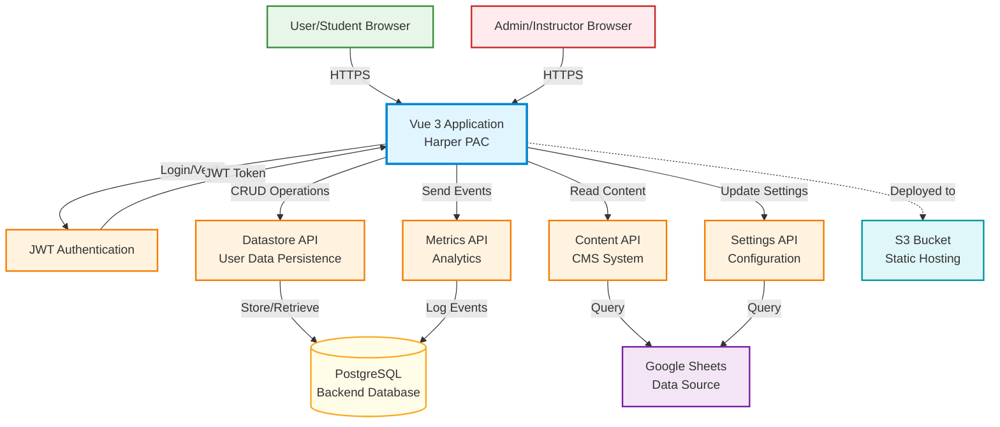

# Harper App - System Architecture Example

This is an example system-level architecture diagram for the Harper physical activity course application, demonstrating the expected output quality and format.

## Diagram

## Analysis

**Application Context:**
This Vue 3 single-page application (SPA) serves as an interactive physical activity course for students at Oregon State University. It integrates with multiple backend services for different concerns and is deployed to AWS S3 as a static site.

**Key Components:**

1. **Vue 3 Application**
   - Client-side SPA built with Vue 3, Vuex, Vue Router
   - Bootstrap 5 UI framework
   - JWT-based authentication
   - Responsive design for student and instructor use

2. **Authentication Service**
   - JWT token-based authentication
   - Role-based access control (student vs. admin)
   - Token validation on protected routes

3. **External APIs**
   - **Datastore API**: Primary persistence layer for user progress data (workouts, logs, program data)
   - **Content API**: Manages instructional content and resources from Google Sheets
   - **Settings API**: Configuration and customizable settings management
   - **Metrics API**: Optional analytics and usage tracking

4. **Data Sources**
   - **Google Sheets**: Acts as a lightweight CMS for content and settings
   - **PostgreSQL Database**: Backend persistence for user data and metrics
   - **S3 Bucket**: Hosts the compiled static Vue application

**Data Flow:**

**Authentication Flow:**

1. Student/admin enters credentials
2. App calls authentication service
3. JWT token returned and stored
4. Token included in all subsequent API requests

**User Data Flow:**

1. Student logs workout or nutrition data in the app
2. Data stored in Vuex state locally
3. On save, Vuex dispatches action to DatastoreAPI mixin
4. DatastoreAPI calls Datastore API with JWT token
5. Backend persists to PostgreSQL database
6. On page load, reverse: fetch from Datastore → Vuex → UI

**Content Delivery:**

1. App fetches instructional content from Content API
2. Content API queries Google Sheets (acts as a CMS)
3. Content rendered in Vue components

**Admin Features:**

1. Instructors access admin panel (role-based routes)
2. Can view participant data, export reports, adjust settings
3. Admin routes protected by `authAdmin` guard checking JWT role

**Deployment Architecture:**

- Vue CLI builds optimized production bundle
- Static files (HTML, JS, CSS) deployed to S3
- CloudFront CDN optional (not shown)
- Environment variables control API endpoints and feature flags

**Security:**

- HTTPS for all communication
- JWT tokens for authentication
- API keys for service access (Content, Settings)
- Role-based access control for admin features

**Configuration:**
Environment variables control behavior:

- `VUE_APP_DO_AUTH` - Enable/disable authentication
- `VUE_APP_USE_DATASTORE` - Enable/disable persistence
- `VUE_APP_CONTENT_API_KEY` - Content API authentication
- `VUE_APP_SETTINGS_API_KEY` - Settings API authentication
- `VUE_APP_METRICS_API_KEY` - Metrics API authentication (optional)
- `VUE_APP_API_URL` - Base URL for all APIs

**Scalability Considerations:**

- Static hosting on S3 enables CDN caching
- API services can scale independently
- Google Sheets provides easy content management without database
- Metrics are optional to reduce backend load

**Notable Patterns:**

- Separation of concerns: different APIs for different data types
- Configuration-driven: feature flags control what's loaded
- Progressive enhancement: works with or without optional services
- Mixin pattern for Datastore integration (reusable CRUD operations)

## Usage Notes

This diagram should be generated when:

- User asks: "Show me the full architecture"
- User asks: "What external services does this app use?"
- User asks: "Generate a system diagram"

The diagram emphasizes:

- External integration boundaries
- Authentication and security
- Data flow between services
- Deployment context
