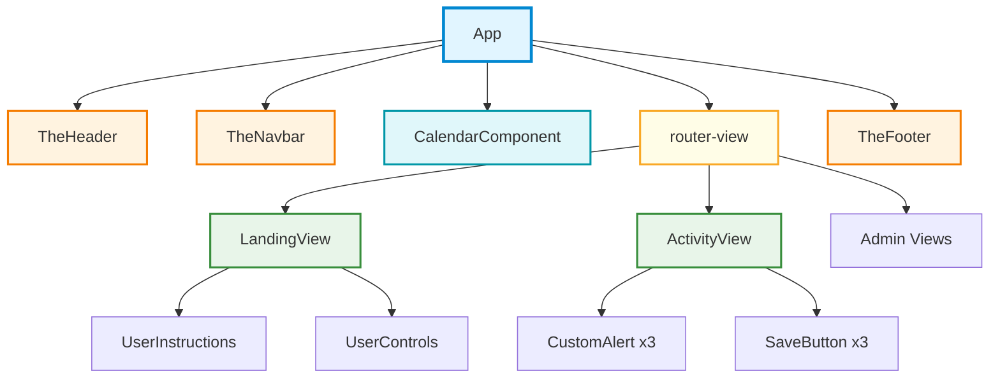
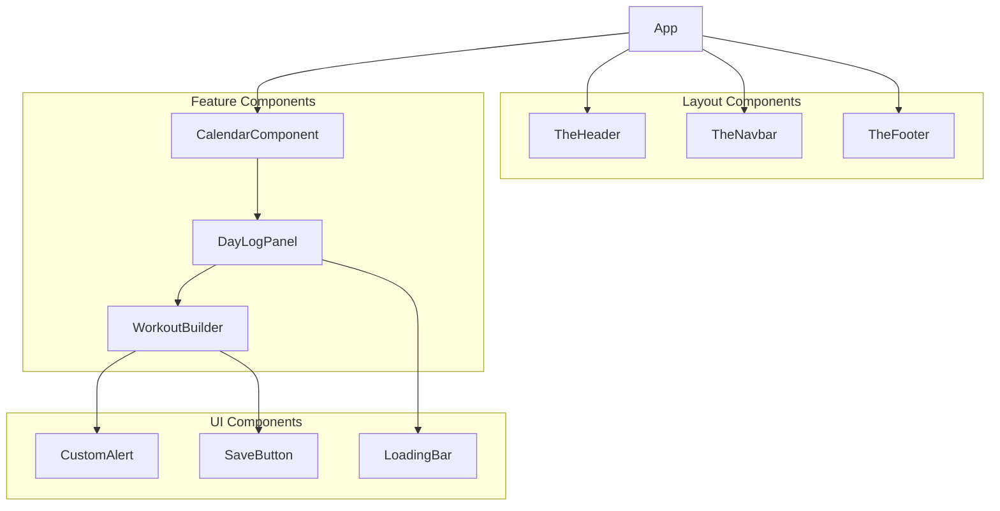
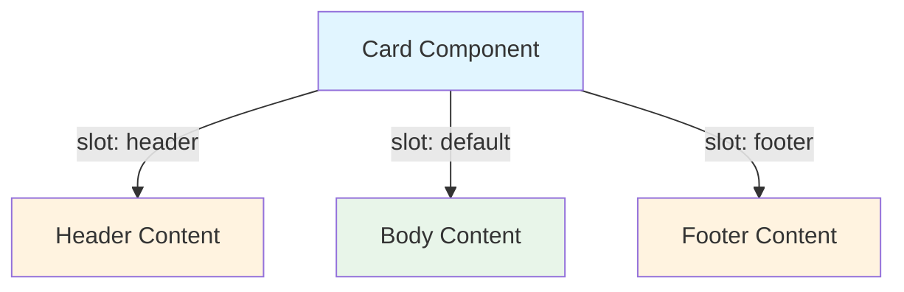
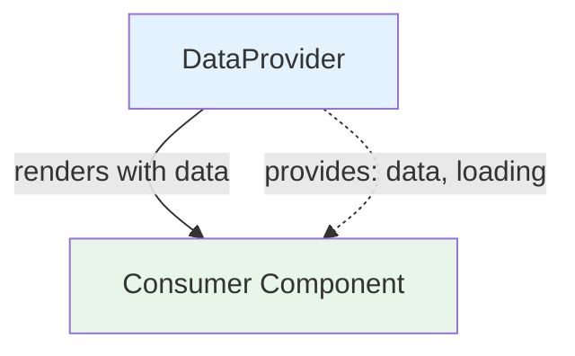
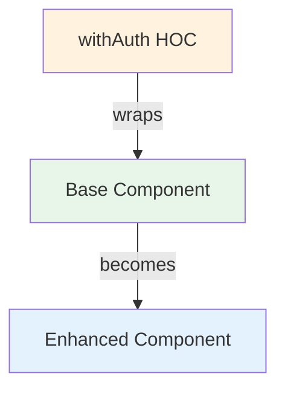

# Component Hierarchy Diagram Template

Component diagrams show parent-child relationships, composition patterns, and data/event flow between components.

## Purpose

Use this template when:

- User asks for "component tree", "component hierarchy", "component structure"
- Showing how components compose together
- Illustrating props and event flow
- Mapping view composition

## Mermaid Graph Type

```mermaid
graph TD
```

**Always use top-down for component hierarchies (parent → child).**

## Node Types

### Root/App Component

```mermaid
App[App]
```

**Style:** Rectangle, light blue, thick border

### Layout Components (Singleton)

```mermaid
TheHeader[TheHeader]
TheNavbar[TheNavbar]
TheFooter[TheFooter]
```

**Style:** Rectangle, light orange

### View/Page Components

```mermaid
HomeView[HomeView]
ActivityView[ActivityView]
```

**Style:** Rectangle, light green

### Feature Components

```mermaid
CalendarComponent[CalendarComponent]
WorkoutBuilder[WorkoutBuilder]
```

**Style:** Rectangle, light cyan

### UI/Reusable Components

```mermaid
CustomAlert[CustomAlert]
SaveButton[SaveButton]
```

**Style:** Rectangle, light purple

### Dynamic/Router Components

```mermaid
RouterView[router-view]
DynamicComponent[Dynamic Component]
```

**Style:** Rounded rectangle `()`, light yellow

## Relationship Types

### Composition (Parent-Child)

```mermaid
Parent --> Child
HomeView --> CustomAlert
```

### Props Flow

```mermaid
Parent -->|:message| Child
Parent -->|:data="items"| List
```

### Event Emission

```mermaid
Child -.->|@save| Parent
Button -.->|@click| Handler
```

**Use dashed line for events flowing up**

### Multiple Instances

```mermaid
View --> Alert1[CustomAlert]
View --> Alert2[CustomAlert]
View --> Alert3[CustomAlert]
```

### Slots/Children

```mermaid
Parent -->|slot: default| Child
Card -->|slot: header| CardHeader
```

## Styling

```mermaid
style App fill:#e1f5ff,stroke:#0288d1,stroke-width:3px
style TheHeader fill:#fff3e0,stroke:#f57c00,stroke-width:2px
style HomeView fill:#e8f5e9,stroke:#388e3c,stroke-width:2px
style CalendarComponent fill:#e0f7fa,stroke:#0097a7,stroke-width:2px
style CustomAlert fill:#f3e5f5,stroke:#7b1fa2,stroke-width:2px
style RouterView fill:#fffde7,stroke:#f9a825,stroke-width:2px
```

## Example: ActivityView Component Tree

```mermaid
graph TD
    ActivityView[ActivityView]
    
    Alert1[CustomAlert - Primary]
    Alert2[CustomAlert - Secondary]
    Alert3[CustomAlert - Warning]
    
    Save1[SaveButton - Standard]
    Save2[SaveButton - Confirm]
    Save3[SaveButton - Delete]
    
    ActivityView --> Alert1
    ActivityView --> Alert2
    ActivityView --> Alert3
    ActivityView --> Save1
    ActivityView --> Save2
    ActivityView --> Save3
    
    Alert1 -->|slot| Content1[Content via Slot]
    Alert2 -->|:content prop| Content2[HTML Content]
    
    Save1 -.->|@beforeSave| BeforeHandler[beforeSave handler]
    Save1 -.->|@afterSave| AfterHandler[afterSave handler]
    Save3 -.->|@beforeSave| DeleteHandler[deleteSomething handler]
    
    style ActivityView fill:#e8f5e9,stroke:#388e3c,stroke-width:3px
    style Alert1 fill:#e3f2fd,stroke:#1976d2,stroke-width:2px
    style Alert2 fill:#e3f2fd,stroke:#1976d2,stroke-width:2px
    style Alert3 fill:#ffebee,stroke:#c62828,stroke-width:2px
    style Save1 fill:#f3e5f5,stroke:#7b1fa2,stroke-width:2px
    style Save2 fill:#f3e5f5,stroke:#7b1fa2,stroke-width:2px
    style Save3 fill:#ffcdd2,stroke:#d32f2f,stroke-width:2px
```

## Full App Component Tree



## Props and Events Detail

When showing data flow in detail:

```mermaid
graph TD
    Parent[Parent Component]
    Child[Child Component]
    
    Parent -->|:items="data"| Child
    Parent -->|:loading="isLoading"| Child
    Parent -->|:config="settings"| Child
    
    Child -.->|@update:items| UpdateHandler[handleUpdate]
    Child -.->|@error| ErrorHandler[handleError]
    Child -.->|@success| SuccessHandler[handleSuccess]
    
    UpdateHandler --> Parent
    ErrorHandler --> Parent
    SuccessHandler --> Parent
```

## Subgraphs for Grouping

Group components by category:



## Composition Patterns

### Slot Pattern



### Render Props / Scoped Slots



### Higher-Order Component



## Best Practices

1. **Start at root:** Begin with App or root component
2. **Show 2-3 levels:** Don't go too deep in one diagram
3. **Group by type:** Use colors or subgraphs
4. **Indicate multiplicity:** "CustomAlert x3" for multiple instances
5. **Show data direction:** Props down (solid), events up (dashed)
6. **Label important props:** Show key data being passed
7. **Limit breadth:** 5-7 children per parent maximum

## Adaptive Detail

### High Level (Default)

- Show major components only
- Group similar components
- Omit props/events

### Medium Detail

- Show key components
- Major props labeled
- Key events shown

### Full Detail

- All components
- All props and types
- All events with handlers

Start high-level, drill down when requested.

## Anti-Patterns

❌ Showing every component in the app (too much)  
❌ Not indicating direction of data flow  
❌ Mixing components with non-component nodes  
❌ No visual distinction between component types  
❌ Overlapping or unclear relationships

## Adding Context

```markdown
**Component Structure:**
- **App:** Root component with layout and router
- **Layout:** TheHeader, TheNavbar, TheFooter (singletons)
- **Views:** Page components managed by router
- **Features:** CalendarComponent, WorkoutBuilder, etc.
- **UI Library:** Reusable presentational components

**Key Patterns:**
- Singleton layout components prefixed with "The"
- View components handle page-level logic
- Feature components integrate with Vuex store
- UI components are purely presentational

**Data Flow:**
- Props flow down from parent to child
- Events bubble up to parent handlers
- Vuex store provides global state
- API services called from view/feature components
```

## Variations

### By View

Focus on one view and its children

### By Feature

Show a feature module's component tree

### UI Library

Show reusable component relationships

### Full App

High-level overview of all major components

Choose based on user's focus area.
