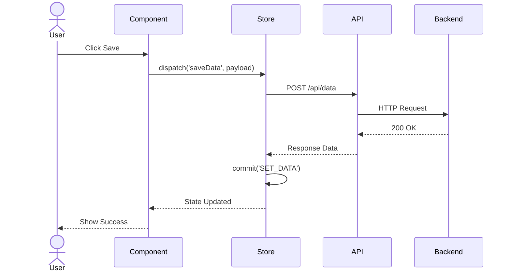
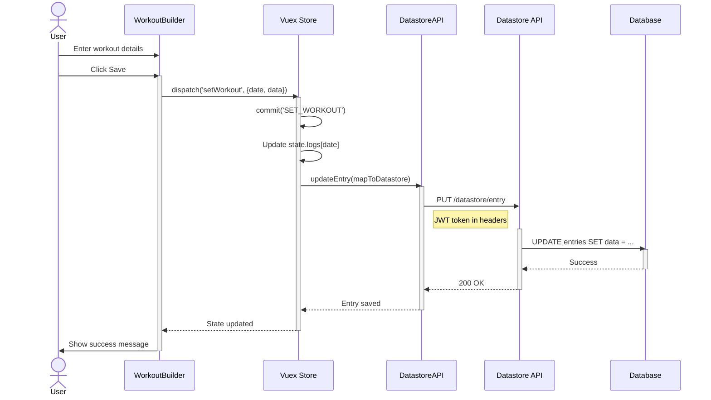
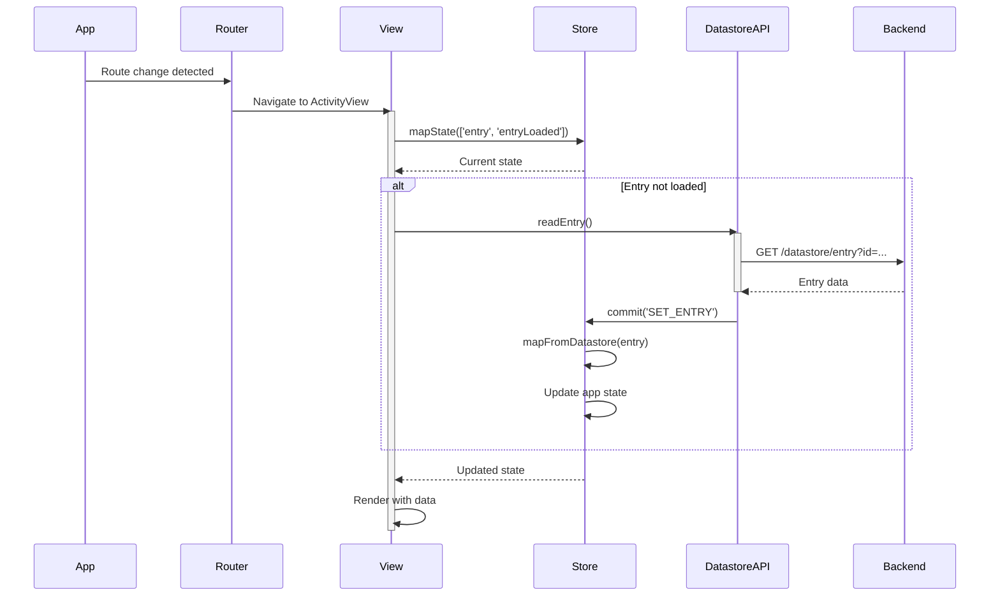
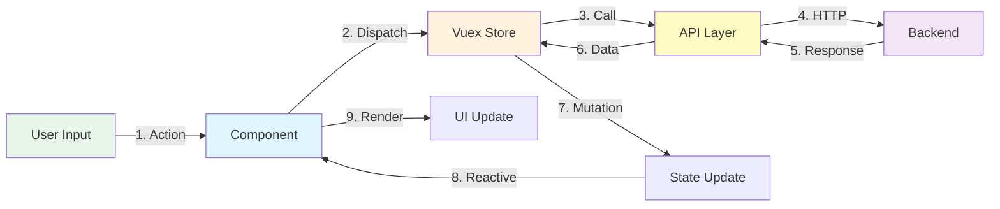
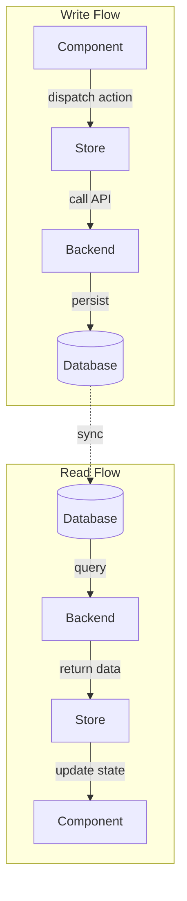
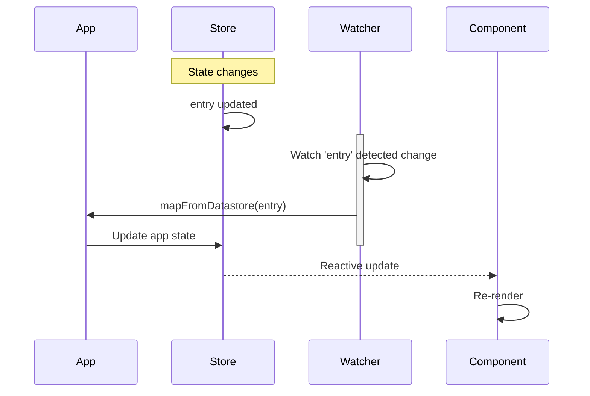
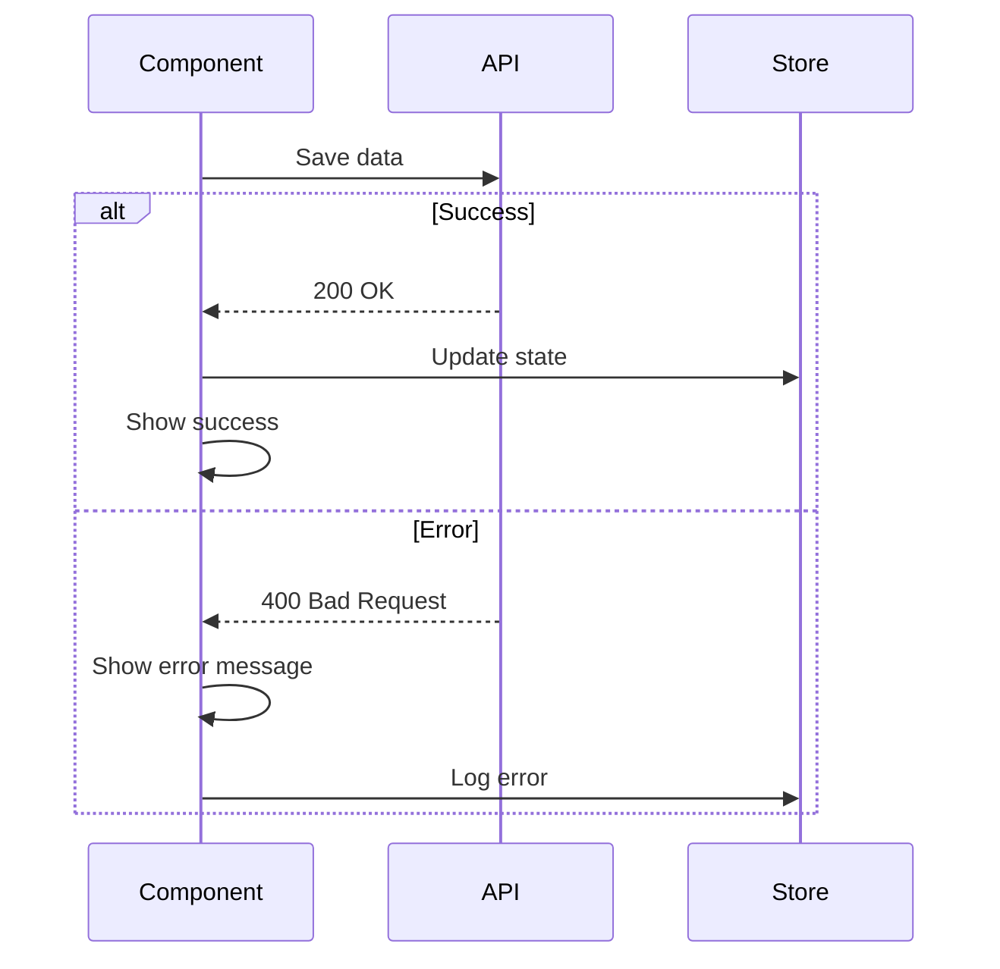

# Data Flow Diagram Template

Data flow diagrams trace how data moves through the application from user actions to state changes to API calls and back.

## Purpose

Use this template when:

- User asks "how does data flow", "trace data", "show the flow"
- Explaining user action → component → state → API sequences
- Illustrating CRUD operations
- Showing data transformation pipelines

## Mermaid Graph Types

### Sequence Diagram (Preferred for Flow)

```mermaid
sequenceDiagram
```

### Graph (Alternative for Architecture)

```mermaid
graph LR
```

**Use sequence diagrams for temporal flow, graphs for architectural flow.**

## Sequence Diagram Pattern

### Basic Structure



### Participants

**Actors:**

```mermaid
actor User
actor Admin
```

**Components:**

```mermaid
participant Component
participant View
participant Button
```

**State Management:**

```mermaid
participant Store
participant Vuex
participant Redux
```

**Services:**

```mermaid
participant API
participant Service
participant Repository
```

**External:**

```mermaid
participant Backend
participant Database
participant ThirdParty
```

### Arrow Types

**Synchronous Call:**

```mermaid
A->>B: method call
```

**Return/Response:**

```mermaid
B-->>A: return value
```

**Async Call:**

```mermaid
A--)B: async call
```

**Activation:**

```mermaid
activate Store
Store->>API: fetch data
deactivate Store
```

## Example: Save Workout Data Flow



## Example: Read Data on Page Load



## Graph Pattern (Architectural)

For showing data flow architecture rather than sequence:



## Data Transformation Flow

Show how data transforms through the pipeline:

```mermaid
graph LR
    Input[User Input<br/>Form Data]
    Validate[Validation<br/>Rules Applied]
    Transform[Transform<br/>to API Format]
    Encrypt[Encrypt<br/>Sensitive Data]
    Send[Send<br/>HTTP Request]
    
    Response[API Response<br/>JSON]
    Parse[Parse<br/>Response]
    MapState[Map to<br/>State Shape]
    Cache[Cache<br/>in Store]
    Render[Render<br/>in UI]
    
    Input --> Validate
    Validate --> Transform
    Transform --> Encrypt
    Encrypt --> Send
    
    Send -.->|Network| Response
    
    Response --> Parse
    Parse --> MapState
    MapState --> Cache
    Cache --> Render
    
    style Input fill:#e8f5e9
    style Validate fill:#fff3e0
    style Transform fill:#e1f5ff
    style Send fill:#f3e5f5
    style Response fill:#fff9c4
    style Render fill:#e8f5e9
```



## Bidirectional Flow

Show read and write flows:



## Watcher/Reactive Flow

Show Vue/React reactive updates:



## Error Handling Flow

Include error paths:



## Best Practices

1. **Show key steps:** Don't include every function call
2. **Number steps:** Help users follow the sequence
3. **Use activation:** Show active participants
4. **Include notes:** Add clarifying information
5. **Show alternatives:** Use alt/else for conditional flow
6. **Label arrows:** Describe what's happening
7. **Group related:** Use subgraphs or participants

## Common Data Flows to Document

### CRUD Operations

- Create: User input → validation → API → database
- Read: Mount → fetch → store → render
- Update: Edit → validate → API → re-fetch
- Delete: Confirm → API → remove from state

### Authentication Flow

- Login → credentials → API → JWT → store token → redirect

### Form Submission

- Fill form → validate → transform → submit → response → update UI

### Real-time Updates

- WebSocket connect → receive message → update store → re-render

### Pagination

- Request page → API with offset → render → user clicks next → repeat

## Anti-Patterns

❌ Too many participants (>7)  
❌ Showing implementation details (function names)  
❌ No clear start/end points  
❌ Missing error flows  
❌ Unclear data transformations

## Adding Context

```markdown
**Data Flow: Workout Logging**

1. User enters workout details in WorkoutBuilder component
2. Component dispatches `setWorkout` action to Vuex store
3. Store commits `SET_WORKOUT` mutation, updating state
4. Store triggers `updateEntry` to persist via DatastoreAPI
5. DatastoreAPI sends PUT request with JWT auth
6. Backend validates and stores in database
7. Success response flows back through layers
8. Component shows success message to user

**Key Transformations:**
- Component form data → Vuex state shape
- Vuex state → `mapToDatastore` getter (JSON string)
- API response → `mapFromDatastore` action (state update)

**Error Handling:**
- Validation errors shown immediately in component
- API errors logged and displayed to user
- Network failures trigger retry logic
```

## Variations

### User Journey

Follow one user action end-to-end

### System Integration

Show data flowing between systems

### State Synchronization

Show how state stays in sync

### Real-time Updates

Show WebSocket or polling patterns

Choose based on the specific flow being explained.
