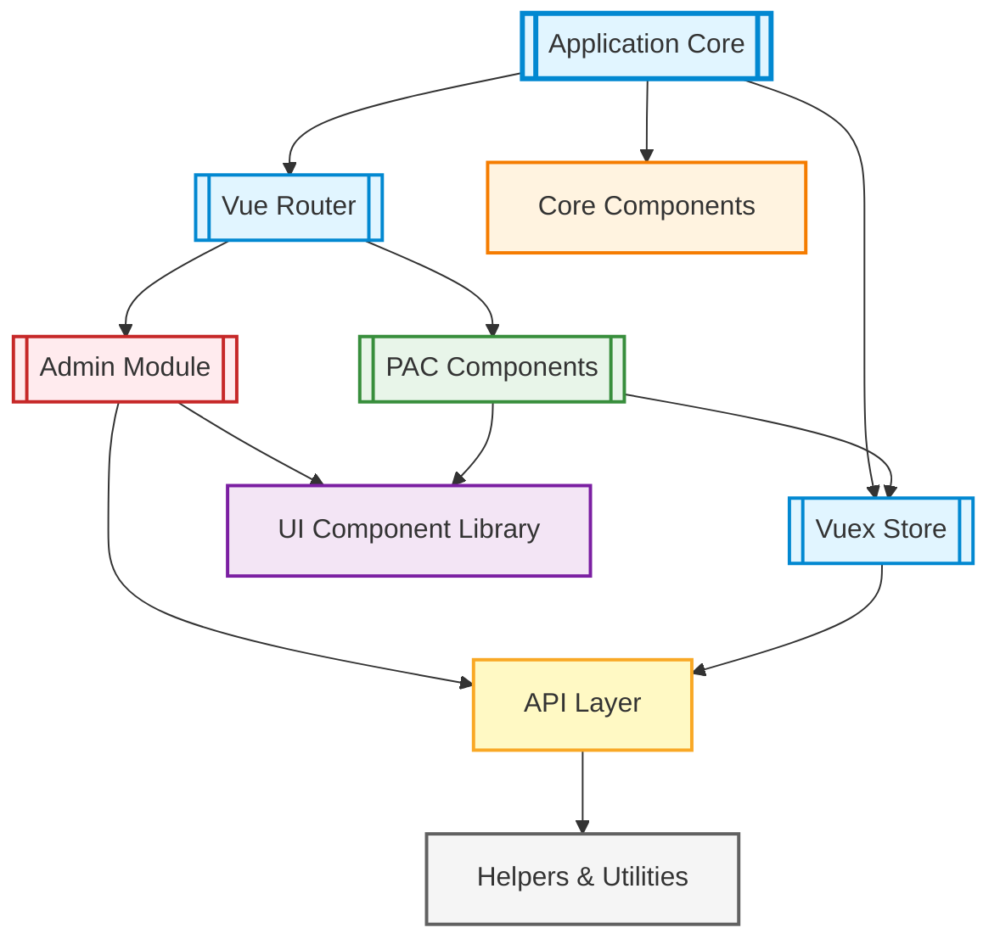
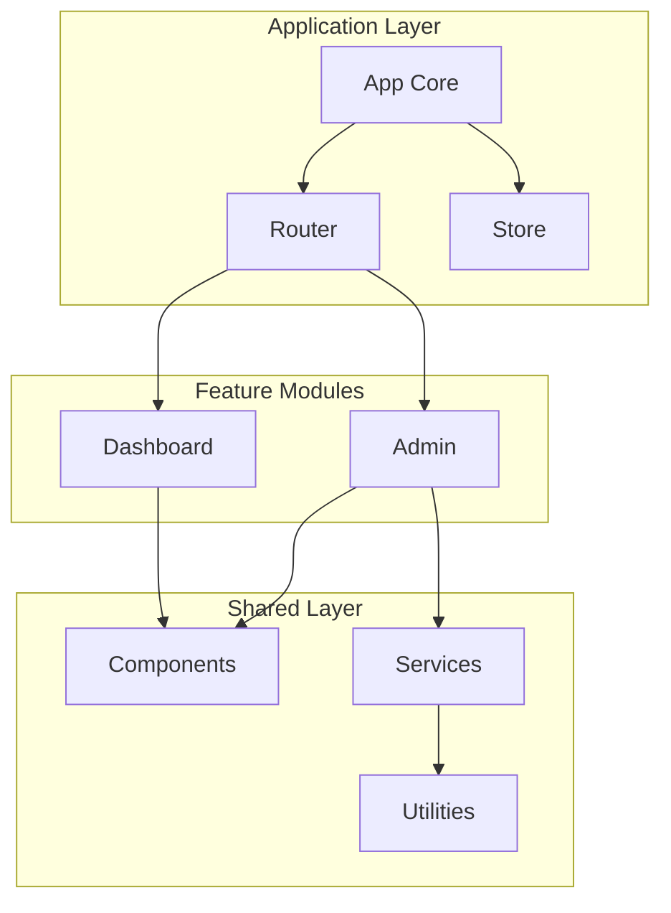
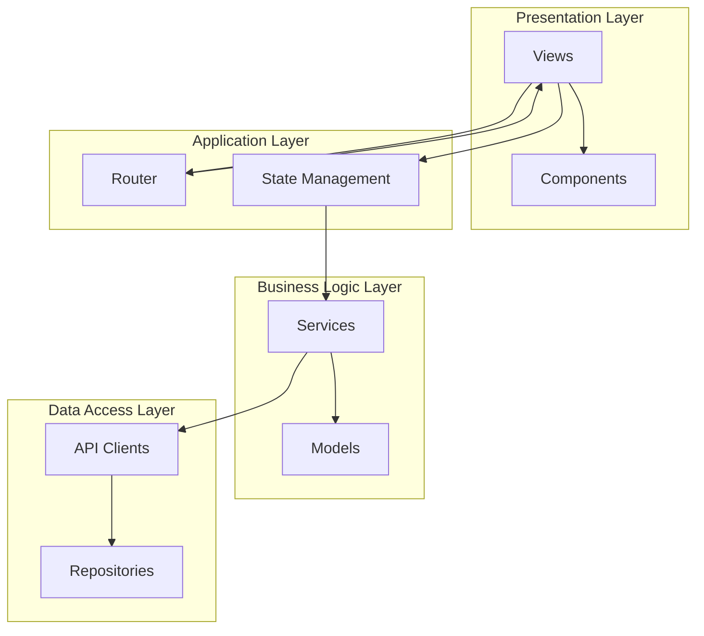
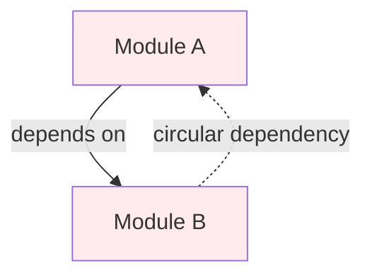

# Module Architecture Diagram Template

Module-level diagrams show major subsystems within the application and their dependencies.

## Purpose

Use this template when:

- User asks for "module diagram", "subsystems", "high-level structure"
- Showing internal architecture organization
- Illustrating module dependencies and boundaries
- Mapping feature areas

## Mermaid Graph Type

```mermaid
graph TD
```

**Use top-down for hierarchical dependencies, left-right for peer relationships.**

## Node Types

### Core Modules

```mermaid
App[Application Core]
Router[Router Module]
Store[State Management]
```

**Style:** Double-lined rectangle `[[ ]]`, light blue

### Feature Modules

```mermaid
Admin[[Admin Module]]
Dashboard[[Dashboard Module]]
Auth[[Authentication Module]]
```

**Style:** Double-lined rectangle, light green

### Component Libraries

```mermaid
CoreComponents[Core Components]
UILibrary[UI Component Library]
```

**Style:** Rectangle, light purple

### Service Layers

```mermaid
APILayer[API Integration Layer]
Services[Business Services]
```

**Style:** Rectangle, light orange

### Shared/Common

```mermaid
Utilities[Shared Utilities]
Helpers[Helpers & Tools]
```

**Style:** Rectangle, light gray

## Relationship Types

### Dependencies

```mermaid
ModuleA -->|depends on| ModuleB
Admin -->|uses| CoreComponents
```

### Data Flow

```mermaid
Component -->|dispatches| Store
Store -->|provides| Component
```

### Integration

```mermaid
Module -->|integrates| APILayer
Router -->|loads| Views
```

### Composition

```mermaid
App -->|includes| Module
Module -->|contains| Components
```

## Styling

```mermaid
style App fill:#e1f5ff,stroke:#0288d1,stroke-width:3px
style Admin fill:#e8f5e9,stroke:#388e3c,stroke-width:2px
style CoreComponents fill:#f3e5f5,stroke:#7b1fa2,stroke-width:2px
style APILayer fill:#fff3e0,stroke:#f57c00,stroke-width:2px
style Utilities fill:#f5f5f5,stroke:#616161,stroke-width:2px
```

## Example: Vue App Modules



## Subgraphs for Organization

Group related modules:



## Dependency Levels

Show architectural layers:



## Circular Dependencies

If circular dependencies exist, show them clearly:



Use dashed line `-.->` for problematic or optional dependencies.

## Best Practices

1. **Group logically:** By feature, layer, or responsibility
2. **Show key dependencies:** Not every single import
3. **Highlight boundaries:** Use subgraphs or colors
4. **Indicate direction:** Dependencies should flow one direction
5. **Label relationships:** "uses", "extends", "integrates"
6. **Limit depth:** 2-3 levels of hierarchy maximum

## Module Types to Identify

### Core/Infrastructure

- Application bootstrap
- Router configuration
- State management setup
- Plugin registration

### Feature Modules

- Self-contained feature areas
- Business domain modules
- Admin/dashboard subsystems

### Component Libraries

- Shared UI components
- Core layout components
- Reusable widgets

### Service Layers

- API integration
- Business logic services
- Data transformation

### Utilities/Helpers

- Pure functions
- Shared constants
- Helper libraries

## Anti-Patterns

❌ Showing individual files (too granular)  
❌ No clear hierarchy or grouping  
❌ Too many bidirectional dependencies  
❌ Mixing abstraction levels  
❌ Unclear module boundaries

## Adding Context

```markdown
**Module Organization:**
- **Core:** Application-wide infrastructure (Router, Store)
- **Admin Module:** Role-based admin interface with dedicated components
- **PAC Components:** Physical Activity Course feature components
- **UI Library:** Reusable presentational components
- **API Layer:** Centralized external service integration

**Key Dependencies:**
- Router loads feature modules dynamically
- All modules depend on UI library for components
- API layer is used by Store actions for data fetching
- Helpers provide utilities to all layers

**Architectural Decisions:**
- Admin is isolated subsystem with own routes
- PAC components integrate directly with Vuex store
- API layer centralizes authentication logic
```

## Variations

### By Feature

Group modules by business capability

### By Layer

Group modules by architectural tier

### By Package

Group modules by npm package or library

Choose based on what best represents the architecture.
