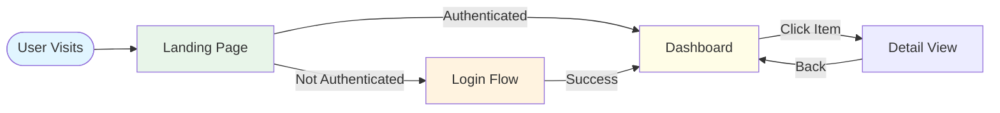
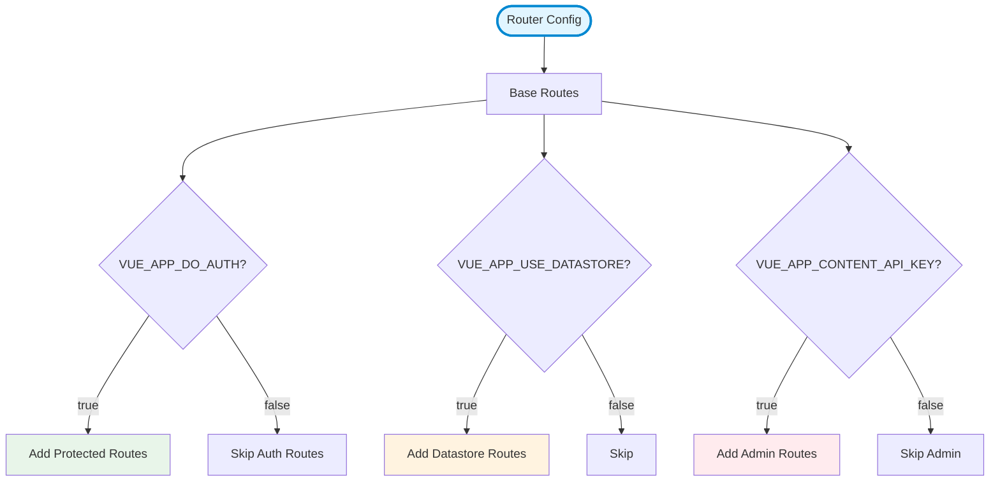
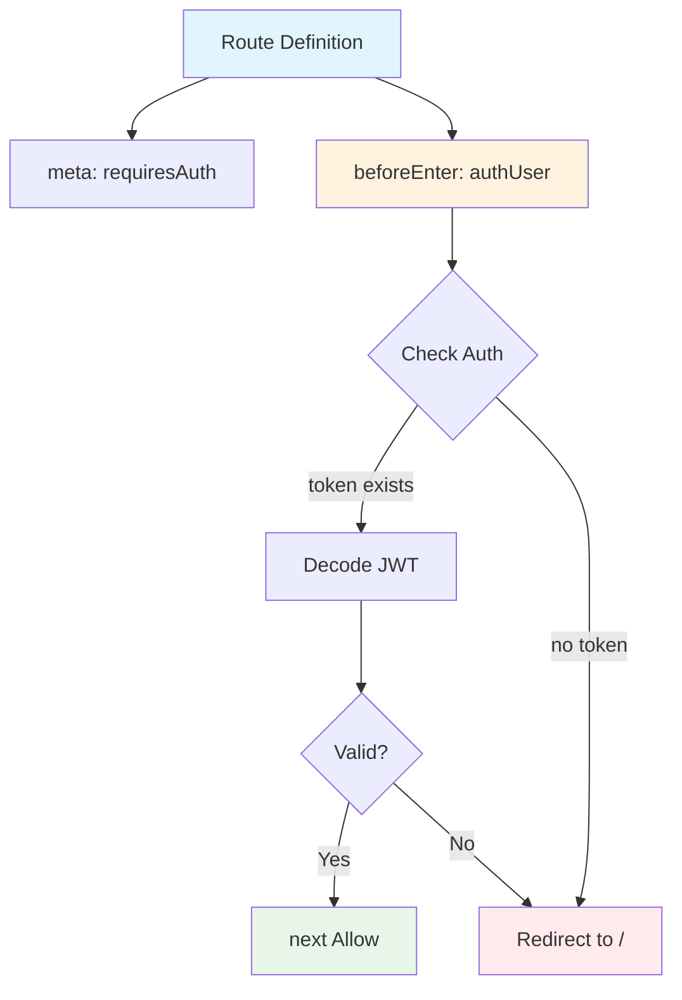

# Routing Diagram Template

Routing diagrams show route structure, navigation hierarchy, guards, lazy loading, and how routes map to components.

## Purpose

Use this template when:

- User asks about "routes", "routing", "navigation", "pages"
- Showing site structure
- Illustrating route hierarchy and nesting
- Mapping route guards and authorization

## Mermaid Graph Type

```mermaid
graph TD
```

**Use top-down for hierarchical routes, left-right for user flow.**

## Node Types

### Root/Entry

```mermaid
Root[/ Route]
Base[Router]
```

**Style:** Stadium shape `([])`, light blue

### Public Routes

```mermaid
Home[/home]
About[/about]
Contact[/contact]
```

**Style:** Rectangle, light green

### Protected Routes

```mermaid
Dashboard[/dashboard]
Profile[/profile]
```

**Style:** Rectangle, light yellow, dashed border

### Admin Routes

```mermaid
AdminPanel[/admin]
Settings[/admin/settings]
```

**Style:** Rectangle, light red

### Dynamic Routes

```mermaid
User[/user/:id]
Post[/posts/:slug]
```

**Style:** Rectangle, light purple

### Nested Routes

Show parent-child relationship with indentation

## Guard/Middleware Notation

```mermaid
Route[Route]
Guard{Auth Guard}

Route --> Guard
Guard -->|Authenticated| Component
Guard -->|Redirect| Login
```

Use diamond `{}` for decision points.

## Example: Vue Router Structure

```mermaid
graph TD
    Root([Router])
    
    Landing[/ Landing]
    Activity[/activity Activity]
    Admin[/admin Admin Panel]
    
    Root --> Landing
    Root --> Activity
    Root --> Admin
    
    AdminConfig[/admin/config]
    AdminContent[/admin/content]
    AdminInstructions[/admin/instructions]
    AdminMetrics[/admin/metrics]
    AdminParticipants[/admin/participants]
    AdminSettings[/admin/settings]
    
    Admin --> AdminConfig
    Admin --> AdminContent
    Admin --> AdminInstructions
    Admin --> AdminMetrics
    Admin --> AdminParticipants
    Admin --> AdminSettings
    
    AuthGuard{authUser}
    AdminGuard{authAdmin}
    
    Activity --> AuthGuard
    AuthGuard -->|Authenticated| ActivityView
    AuthGuard -->|Redirect| Landing
    
    Admin --> AdminGuard
    AdminGuard -->|Admin Role| AdminViews[Admin Views]
    AdminGuard -->|401 Unauthorized| Landing
    
    style Root fill:#e1f5ff,stroke:#0288d1,stroke-width:3px
    style Landing fill:#e8f5e9,stroke:#388e3c,stroke-width:2px
    style Activity fill:#fffde7,stroke:#f9a825,stroke-width:2px,stroke-dasharray: 5 5
    style Admin fill:#ffebee,stroke:#c62828,stroke-width:2px,stroke-dasharray: 5 5
    style AuthGuard fill:#fff3e0
    style AdminGuard fill:#ffcdd2
```

## Route Hierarchy with Components

```mermaid
graph TD
    Router([Vue Router])
    
    Root[/ → Root]
    
    Router --> Root
    
    Root --> Landing[/ → LandingView]
    Root --> Activity[/activity → ActivityView]
    
    Activity --> AuthGuard{Auth Required}
    
    AuthGuard -->|Yes| ActivityComponent[ActivityView Component]
    AuthGuard -->|No| RedirectLanding[Redirect to /]
    
    Root --> Admin[/admin → AdminRouter]
    
    Admin --> AdminGuard{Admin Guard}
    
    AdminGuard -->|ROLE.ADMIN| AdminRoutes[Admin Routes]
    AdminGuard -->|Not Admin| Unauthorized[401 Unauthorized]
    
    AdminRoutes --> Config[/config → ConfigView]
    AdminRoutes --> Content[/content → ContentView]
    AdminRoutes --> Participants[/participants → ParticipantsView]
    AdminRoutes --> Metrics[/metrics → MetricsView]
    AdminRoutes --> Settings[/settings → SettingsView]
    
    style Router fill:#e1f5ff,stroke:#0288d1,stroke-width:3px
    style Landing fill:#e8f5e9
    style ActivityComponent fill:#e8f5e9
    style Config fill:#ffebee
    style Content fill:#ffebee
    style Participants fill:#ffebee
```

## Lazy Loading Routes

```mermaid
graph TD
    Router([Router])
    
    Home[/home → Home<br/>Eager Load]
    About[/about → About<br/>import lazy]
    Dashboard[/dashboard → Dashboard<br/>import lazy]
    
    Router --> Home
    Router --> About
    Router --> Dashboard
    
    style Home fill:#e8f5e9
    style About fill:#fff3e0
    style Dashboard fill:#fff3e0
    
    Home -.->|Bundled| MainChunk[main.js]
    About -.->|Separate| AboutChunk[about.chunk.js]
    Dashboard -.->|Separate| DashboardChunk[dashboard.chunk.js]
```

## Navigation Flow

Show user navigation paths:



## Conditional Routes

Routes added based on configuration:



## Route Meta and Guards



## Nested Routes Hierarchy

```mermaid
graph TD
    Dashboard[/dashboard]
    
    Overview[/dashboard/overview]
    Stats[/dashboard/stats]
    Reports[/dashboard/reports]
    
    Dashboard --> Overview
    Dashboard --> Stats
    Dashboard --> Reports
    
    ReportsDaily[/dashboard/reports/daily]
    ReportsWeekly[/dashboard/reports/weekly]
    ReportsMonthly[/dashboard/reports/monthly]
    
    Reports --> ReportsDaily
    Reports --> ReportsWeekly
    Reports --> ReportsMonthly
    
    style Dashboard fill:#e1f5ff,stroke:#0288d1,stroke-width:3px
    style Overview fill:#e8f5e9
    style Stats fill:#e8f5e9
    style Reports fill:#fff3e0,stroke:#f57c00,stroke-width:2px
    style ReportsDaily fill:#fffde7
    style ReportsWeekly fill:#fffde7
    style ReportsMonthly fill:#fffde7
```

## Route Params and Query

```mermaid
graph LR
    List[/users<br/>Users List]
    Detail[/users/:id<br/>User Detail]
    Edit[/users/:id/edit<br/>Edit User]
    
    List -->|Click User| Detail
    Detail -->|Click Edit| Edit
    Edit -->|Save| Detail
    Detail -->|?tab=profile| ProfileTab[Profile Tab]
    Detail -->|?tab=settings| SettingsTab[Settings Tab]
    
    style List fill:#e8f5e9
    style Detail fill:#e1f5ff
    style Edit fill:#fff3e0
```

## Best Practices

1. **Show hierarchy:** Parent-child relationships clear
2. **Indicate guards:** Show authorization checks
3. **Label routes:** Include path and component
4. **Mark protection:** Visual distinction for protected routes
5. **Show lazy loading:** Indicate code splitting
6. **User flow:** Navigation paths users take
7. **Conditional routes:** Based on configuration

## Common Patterns to Document

### Route Types

- Public routes (anyone can access)
- Protected routes (requires authentication)
- Admin routes (requires specific role)
- Dynamic routes (with parameters)

### Guards

- Global guards (beforeEach)
- Route-level guards (beforeEnter)
- Component guards (beforeRouteEnter)

### Structure

- Flat routes vs nested routes
- Route grouping by feature
- Lazy loading strategy

### Navigation

- User authentication flow
- Role-based access
- Redirect logic

## Anti-Patterns

❌ Every single route (too many)  
❌ No visual distinction between route types  
❌ Missing guard information  
❌ Unclear route hierarchy  
❌ No indication of lazy loading

## Adding Context

```markdown
**Routing Structure**

**Public Routes:**
- `/` - Landing page (conditionally shown)
- `/activity` - Main activity view (requires auth)

**Admin Routes:**
- `/admin/*` - Admin subsystem (requires ROLE.ADMIN)
  - `/admin/config` - Configuration management
  - `/admin/content` - Content entries
  - `/admin/participants` - User management
  - `/admin/metrics` - Analytics dashboard
  - `/admin/settings` - Settings management

**Guards:**
- `authUser` - Validates JWT token
- `authAdmin` - Checks for admin role

**Conditional Routing:**
- Admin routes only added if `VUE_APP_CONTENT_API_KEY` exists
- Auth routes only added if `VUE_APP_DO_AUTH` is true
- Landing page shown based on `config.useLandingPage`

**Lazy Loading:**
- Admin routes lazy loaded for code splitting
- Improves initial bundle size

**Navigation Flow:**
1. User lands on `/` (landing or activity based on config)
2. If not authenticated → redirected to auth
3. If authenticated → access to /activity
4. If admin role → additional /admin/* routes available
```

## Variations

### Site Map

Full route hierarchy overview

### Authorization Flow

Focus on guards and access control

### User Journey

Navigation paths through the app

### Code Splitting

Show lazy loaded route boundaries

Choose based on what aspect of routing to emphasize.
