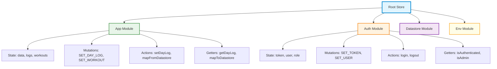
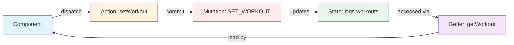
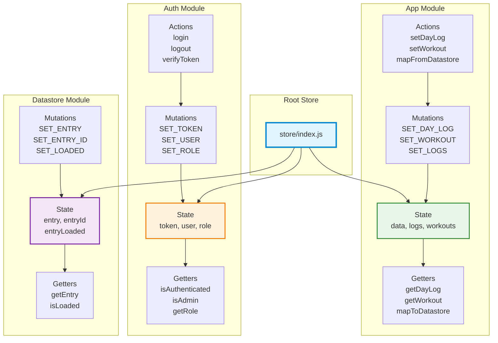
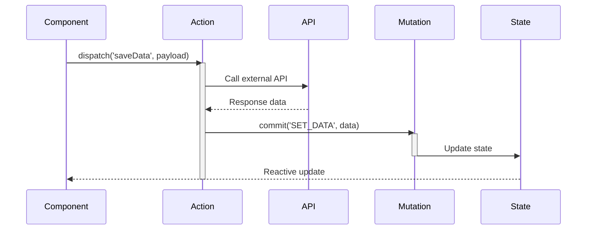
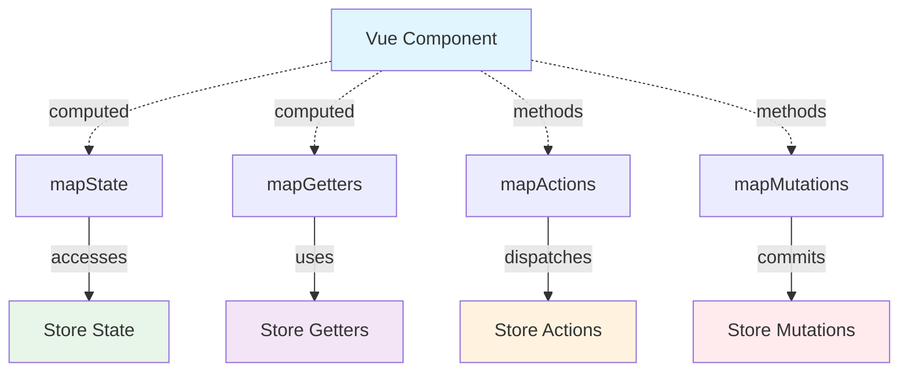
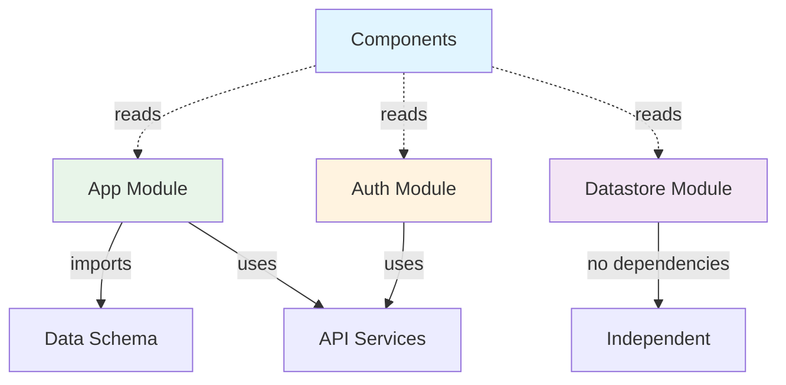
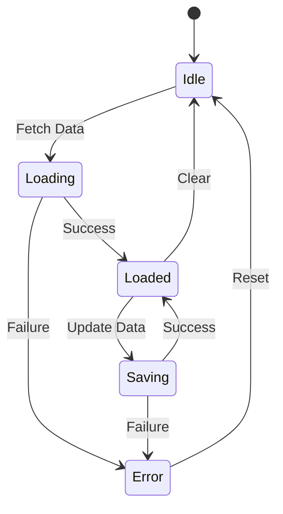
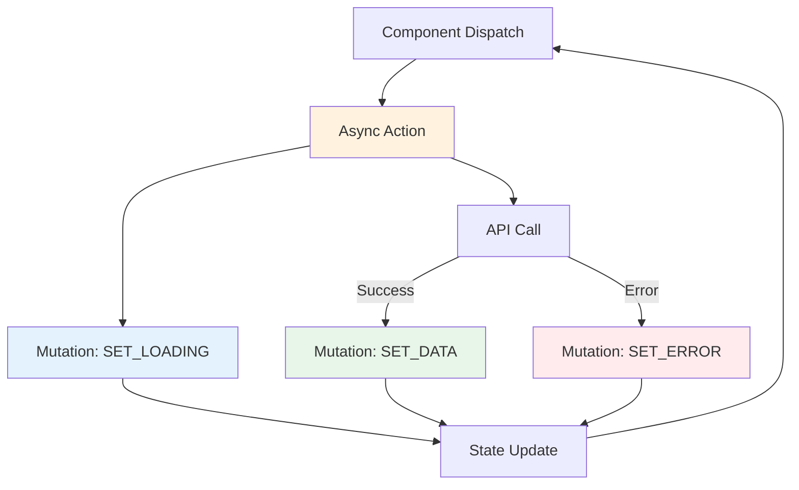
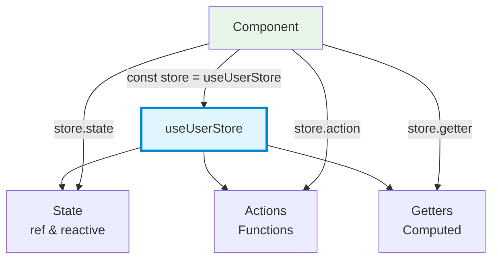
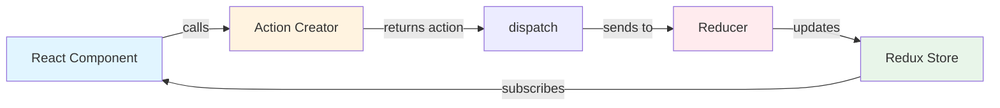

# State Management Diagram Template

State management diagrams show store structure, modules, data flow between actions/mutations/getters, and component integration.

## Purpose

Use this template when:

- User asks about "store", "state management", "Vuex", "Redux", "Pinia"
- Showing state architecture
- Illustrating actions → mutations → state flow
- Mapping state to components

## Mermaid Graph Types

### State Diagram (Ideal for State Machines)

```mermaid
stateDiagram-v2
```

### Graph (Better for Store Architecture)

```mermaid
graph TD
```

**Use graph for store structure, state diagram for state transitions.**

## Store Structure Pattern

### Modular Store (Vuex/Redux)



## Action → Mutation → State Flow



## Example: Full Vuex Store Architecture



## Data Flow Through Store



## State Access Patterns

### Component Integration



## Module Dependencies



## State Machine Pattern

For actual state transitions:



## Async Action Pattern



## Getters and Computed State

```mermaid
graph LR
    State[Raw State<br/>logs: {...}]
    
    Getter1[Getter: getDayLog<br/>Returns log for date]
    Getter2[Getter: getWorkout<br/>Returns workout for date]
    Getter3[Getter: mapToDatastore<br/>Transforms to JSON]
    
    Component1[DayLogPanel]
    Component2[WorkoutBuilder]
    Component3[App]
    
    State --> Getter1
    State --> Getter2
    State --> Getter3
    
    Getter1 --> Component1
    Getter2 --> Component2
    Getter3 --> Component3
    
    style State fill:#e8f5e9
    style Getter1 fill:#f3e5f5
    style Getter2 fill:#f3e5f5
    style Getter3 fill:#f3e5f5
```

## Pinia Store Pattern (Vue 3 Alternative)



## Redux Pattern (React)



## Best Practices

1. **Show module boundaries:** Clear separation of concerns
2. **Indicate flow direction:** Actions → Mutations → State → Getters
3. **Label relationships:** "commits", "dispatches", "accesses"
4. **Group by module:** Use subgraphs for clarity
5. **Show async patterns:** API calls in actions
6. **Component integration:** How components access store
7. **State shape:** Include key state properties

## Common Patterns to Document

### Module Structure

- What modules exist
- What they're responsible for
- Dependencies between modules

### Data Flow

- How actions trigger mutations
- How state updates propagate
- How getters compute derived state

### Component Integration

- mapState, mapGetters usage
- mapActions, mapMutations usage
- Direct store access patterns

### Async Operations

- API calls in actions
- Loading/error states
- Optimistic updates

## Anti-Patterns

❌ Direct state mutation from components  
❌ Unclear action vs mutation responsibilities  
❌ Missing async operation handling  
❌ No module organization  
❌ Circular dependencies between modules

## Adding Context

```markdown
**Vuex Store Architecture**

**Modules:**
- **App:** Application state (logs, workouts, data schema)
- **Auth:** Authentication state (token, user, role)
- **Datastore:** External persistence (entry, loading state)
- **Env:** Environment configuration (feature flags)

**Data Flow:**
1. Components dispatch actions (async operations)
2. Actions call APIs and commit mutations
3. Mutations update state (synchronous only)
4. Getters provide computed/derived state
5. Components reactively update from state

**Key Patterns:**
- `mapFromDatastore`: Action that transforms external data to state
- `mapToDatastore`: Getter that transforms state to external format
- Watchers in App.vue synchronize Datastore and App modules
- Auth guards use getters to check permissions

**Integration:**
- Components use mapState/mapGetters for reading
- Components use mapActions for writing
- Mixin pattern (DatastoreAPI) provides reusable store operations
```

## Variations

### Architecture View

Show overall store structure and modules

### Flow View

Show action → mutation → state → getter flow

### Integration View

Show how components interact with store

### Module Detail

Deep dive into one module's structure

Choose based on what aspect user wants to understand.
