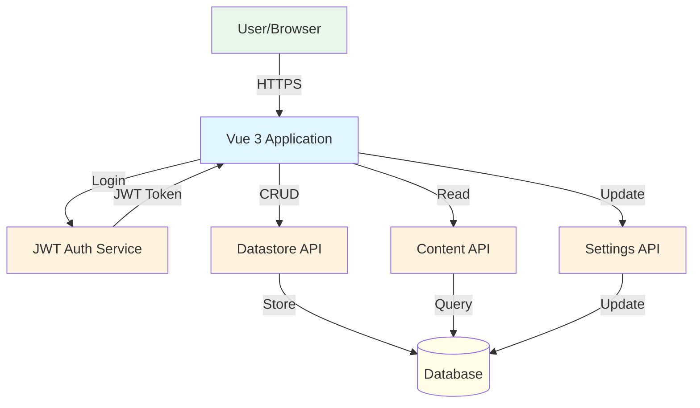
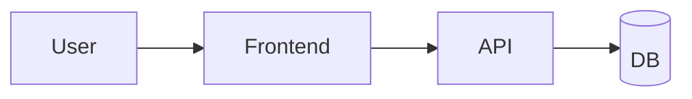
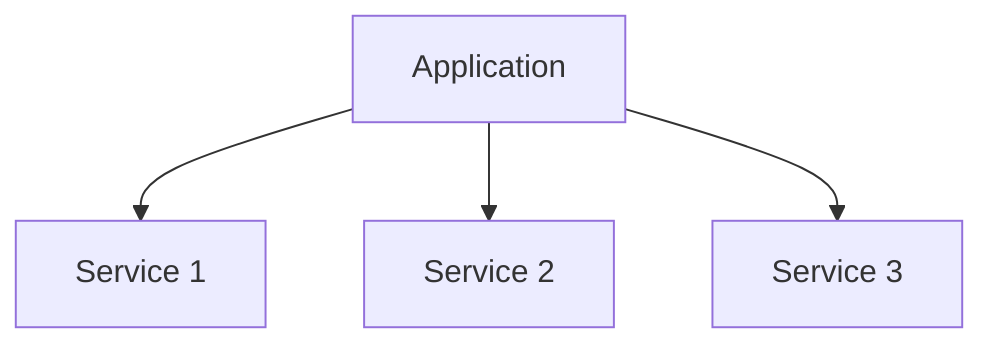
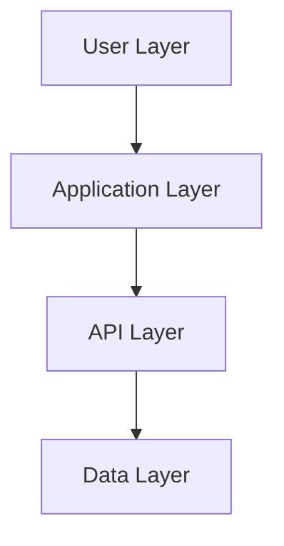
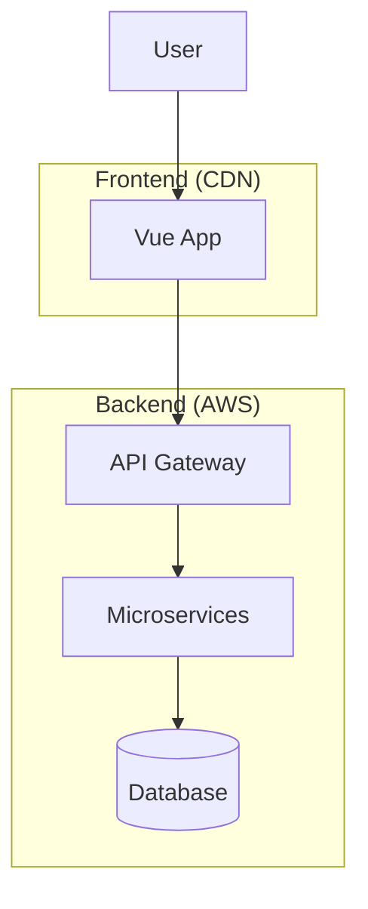

# System Architecture Diagram Template

System-level diagrams show the application within its ecosystem: users, external services, databases, and deployment boundaries.

## Purpose

Use this template when:

- User asks for "system diagram", "full architecture", "overview"
- Showing external integrations and boundaries
- Illustrating deployment architecture
- Mapping user flows through the system

## Mermaid Graph Type

```mermaid
graph TD
```

or

```mermaid
graph LR
```

**Choose TD (top-down) for vertical hierarchy, LR (left-right) for horizontal flow.**

## Node Types

### Actors/Users

```mermaid
User[User/Browser]
Admin[Administrator]
```

**Style:** Rectangle, light green fill

### Application

```mermaid
App[Vue 3 Application]
Frontend[React Frontend]
```

**Style:** Rectangle, light blue fill

### External Services

```mermaid
Auth[Authentication Service]
API[REST API]
GraphQL[GraphQL Server]
```

**Style:** Rectangle, light orange fill

### Databases/Storage

```mermaid
DB[(PostgreSQL Database)]
Cache[(Redis Cache)]
Storage[(S3 Storage)]
```

**Style:** Cylinder, light yellow fill

### Third-Party Services

```mermaid
Google[Google APIs]
Stripe[Stripe Payments]
Email[SendGrid Email]
```

**Style:** Rectangle, light purple fill

## Relationship Types

### User Interactions

```mermaid
User -->|HTTP/HTTPS| App
User -->|Authenticates| Auth
```

### API Calls

```mermaid
App -->|REST API| Backend
App -->|GraphQL Query| GraphQL
Frontend -->|POST /api/users| API
```

### Data Operations

```mermaid
API -->|Read/Write| DB
Backend -->|Cache| Redis
App -->|Upload| Storage
```

### Authentication Flow

```mermaid
App -->|JWT Token| Auth
Auth -->|Validates| TokenService
```

## Styling

Apply consistent colors:

```mermaid
style User fill:#e8f5e9
style Admin fill:#e8f5e9
style App fill:#e1f5ff
style Frontend fill:#e1f5ff
style Auth fill:#fff3e0
style API fill:#fff3e0
style DB fill:#fffde7
style Cache fill:#fffde7
style Google fill:#f3e5f5
style Stripe fill:#f3e5f5
```

## Example: Vue App with External APIs



## Layout Strategies

### Simple Linear Flow



### Hub and Spoke



### Layered Architecture



## Subgraphs for Boundaries

Use subgraphs to show deployment boundaries or organizational groupings:



## Best Practices

1. **Limit nodes:** 8-12 major components maximum
2. **Clear labels:** Use descriptive names and protocols
3. **Consistent flow:** Top-to-bottom or left-to-right
4. **Group related:** Use subgraphs for boundaries
5. **Color code:** By layer or responsibility
6. **Show data flow:** Label edges with data types or protocols

## Anti-Patterns

❌ Too many nodes (>15) makes it unreadable  
❌ Unlabeled relationships (what data flows?)  
❌ Mixing abstraction levels (components + infrastructure)  
❌ Circular dependencies without explanation  
❌ No visual hierarchy

## Adding Context

Include a brief legend or explanation:

```markdown
**Key Components:**
- User interacts via browser (HTTPS)
- Vue 3 app handles UI and state
- JWT authentication for security
- Three separate API services for modularity
- Shared database for persistence

**Data Flow:**
1. User authenticates → receives JWT
2. JWT included in all API requests
3. APIs validate token and process requests
4. Results returned to Vue app for display
```

## Variations

### Deployment View

Focus on infrastructure: servers, CDNs, load balancers

### Integration View

Focus on external services: payment, email, analytics

### Security View

Focus on authentication, authorization, data encryption

Choose the variation that best answers the user's question.
